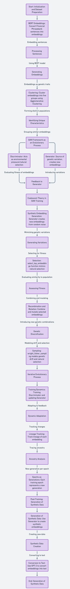

# Synth-Gen
Synthesizing financial data by integrating BERT and GPT-2 models with coalescent theory, aiming to enhance the quality and diversity of financial datasets for predictive modeling.

## Table of Contents
1. [Introduction](#introduction)
2. [Motivation](#motivation)
3. [Objective](#objective)
4. [Methodology](#methodology)
5. [Tech Stack](#tech-stack)
6. [Salient Contributions](#salient-contributions)
7. [Results](#results)
8. [Conclusion](#conclusion)

## Introduction
In the realm of financial data analysis, challenges such as inadequate data quality, limited scope, and inherent biases severely restrict the development of robust predictive models. Our project addresses these issues by generating synthetic financial data that offers a wider scope and greater diversity, thus enhancing predictive modeling capabilities and ensuring a higher degree of data integrity.

## Motivation
This project is driven by the urgent need to overcome the limitations of current financial datasets. With synthetic data that is representative of real-world financial scenarios, we aim to provide a solution to the scarcity and biases present in existing datasets. This will facilitate more accurate and effective financial analysis and modeling.

## Objective
The objective of this research is to generate synthetic financial data that accurately represents the dynamism of financial markets, using an innovative method that blends evolutionary biology principles with deep learning techniques.

## Methodology
We propose a unique methodology that incorporates BERT embeddings for sentence representation, GAN for synthetic data generation, and coalescent theory from evolutionary biology to ensure data diversity and integrity. The process involves several phases, including data representation, clustering of embeddings, evolutionary synthesis, and adversarial training.

## Tech Stack
The project utilizes a robust stack of technologies and libraries specifically chosen for tasks in data processing, machine learning, and natural language processing:
- **Python**: The primary programming language used to implement all aspects of the project.
- **NumPy**: Essential for handling numerical operations on large, multi-dimensional arrays and matrices.
- **Pandas**: Provides user-friendly data structures and data analysis tools, crucial for handling and processing dataset files.
- **Scikit-learn**: Used for its efficient tools for statistical modeling and machine learning, such as clustering algorithms.
- **Hugging Face Transformers**: Offers pre-trained models like BERT and GPT-2 and tools for natural language processing tasks.
- **Hugging Face Datasets**: Facilitates easy access to datasets, including the Financial PhraseBank used in this project.
- **PyTorch**: Serves as the backbone for the BERT and GPT-2 models, providing dynamic computational graph generation and gradient calculations.
- **Keras**: Used to build and train the Generative Adversarial Network (GAN) models, with its simple and flexible API.
- **TensorFlow**: As Keras is an interface for TensorFlow, it is the underlying framework that provides powerful tools for deep learning and serves as the computation engine for Keras models.
- **Matplotlib**: Utilized for generating plots and visualizations to analyze the results, such as dendrograms for cluster analysis.
- **SciPy**: Offers additional functionality for scientific computing, such as generating dendrograms and calculating pairwise distances.
- **BERT**: Used for generating token embeddings from financial texts.
- **GPT-2**: Used for generating coherent textual outputs from embeddings.
- **GANs**: Used for synthesizing new data points.

## Salient Contributions
- **Diverse and Representative Datasets:** Overcoming the limitations of traditional financial data by generating a rich variety of synthetic datasets.
- **Enhanced Data Quality and Integrity:** Providing unbiased, high-integrity datasets for more accurate financial analysis.
- **Innovative Cross-Disciplinary Methodology:** Blending concepts from biology, deep learning, and finance to pioneer synthetic data generation techniques.
- **Resource Enrichment for Financial Analysis:** Offering datasets that closely resemble authentic financial data, thus significantly enhancing analytical resources.

## Results
The implementation of this methodology has led to the creation of synthetic datasets that closely mirror the complexity of real-world financial data and enhance the resources available for financial analysis and modeling.

## Conclusion
Our research marks a significant step forward in financial data analysis, offering new tools and methods that enrich the sector and pave the way for future interdisciplinary applications.
